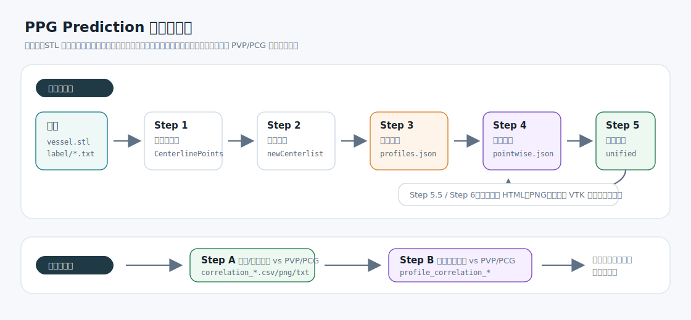
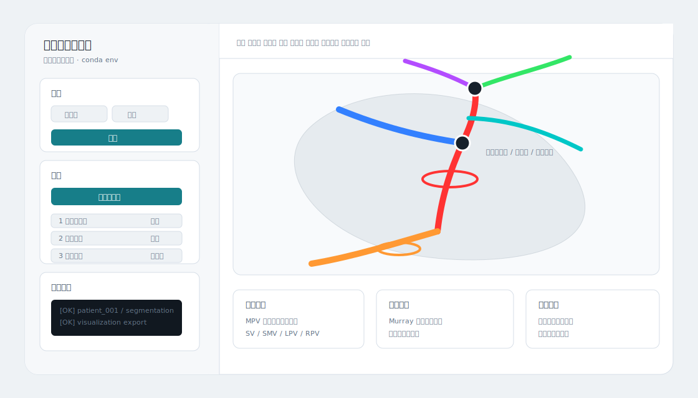
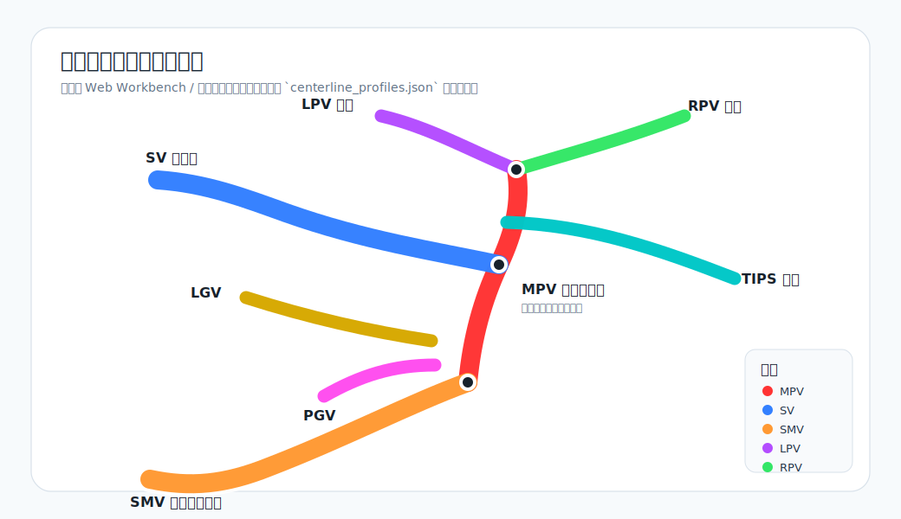
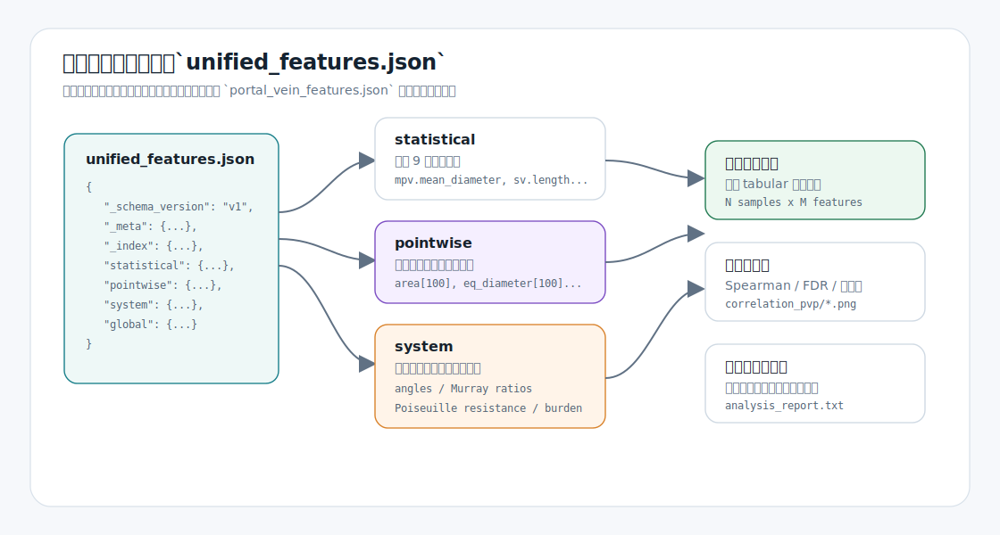

# PPG Prediction：门静脉三维血管分析与 PVP/PCG 特征工程

PPG Prediction 是一个面向门静脉系统的三维血管定量分析仓库。它从 STL 格式的血管模型出发，自动完成中心线提取、中心线平滑、解剖分段、逐点剖面测量、统计/系统特征汇总、3D 可视化导出，并可进一步做跨患者的 PVP 或 PCG 相关性分析。

项目当前同时支持两种使用方式：

- 本地 Web Workbench：适合交互式载入 STL、逐步运行流水线、检查 3D 分段和截面。
- Python 批处理：适合对一批患者文件夹自动提取特征并生成相关性报告。



## 项目能做什么

| 能力 | 说明 | 主要输出 |
|---|---|---|
| 三维中心线提取 | STL 体素化、距离变换、3D 骨架化、图剪枝和 BFS 建树 | `CenterlinePoints.txt` |
| 中心线平滑 | 对关键点之间的血管段做样条平滑，保留端点和分叉点拓扑 | `newCenterlist.txt` |
| 解剖分段 | 自动识别 MPV、SV、SMV、LPV、RPV、TIPS、LGV、PGV | `centerline_profiles.json` |
| 逐点剖面 | 沿血管轴采样截面积、等效直径、周长、圆度、曲率、内切半径 | `centerline_pointwise_profiles.json` |
| 统一特征 | 汇总单段统计特征、全局特征、系统联合特征和剖面曲线 | `unified_features.json` |
| 3D 可视化 | 输出交互 HTML、静态 PNG，或打开 VTK 窗口检查 | `vis_interactive.html`, `vis_overview.png` |
| 跨患者分析 | Spearman 相关、FDR 校正、热力图、散点图、自动报告和推荐特征 | `correlation_*`, `profile_correlation_*` |

## 快速开始：Web Workbench

推荐先从 Web Workbench 入手，因为它可以边运行边看 STL、中心线、分段、截面环和特征表。



### 1. 安装依赖

建议使用 Conda 环境。Python 版本建议 3.9 到 3.11。

```powershell
conda create -n ppg_prediction python=3.10
conda activate ppg_prediction

pip install numpy scipy scikit-image networkx trimesh shapely pandas matplotlib plotly kaleido vtk pillow rtree
```

说明：

- `web_frontend.py` 本身只依赖 Python 标准库和本仓库文件，但真正运行算法时需要上面的科学计算依赖。
- `trimesh.proximity.signed_distance` 在部分环境中需要 `rtree`；如果截面或内切半径计算报空间索引相关错误，先确认 `rtree` 已安装。
- `kaleido` 用于 Plotly 静态图导出，缺失时通常只影响 PNG 输出，不影响 HTML 交互图。

### 2. 启动本地服务

方式一：直接运行 Python 服务。

```powershell
python web_frontend.py --host 127.0.0.1 --port 8765
```

方式二：使用 PowerShell 启动脚本，并指定 Conda 环境。

```powershell
Copy-Item web_frontend_config.example.json web_frontend_config.json
.\start_web_frontend.ps1 -CondaEnv ppg_prediction
```

然后在浏览器打开：

```text
http://127.0.0.1:8765
```

### 3. 运行流程

Web 页面支持两种输入模式：

- 单文件模式：上传一个 `.stl` 文件，输出写入 `web_runs/<session>/...`，也可以手动指定输出目录。
- 批量模式：输入病例根目录，默认查找每个子目录下的 `vessel.stl`。

常用操作：

- 点击“载入”创建会话。
- 点击“自动全流程”按顺序运行中心线、平滑、分段、剖面、特征、可视化导出。
- 使用图层开关检查模型、原始线、平滑线、解剖段、分叉点、特征点、间隔截面、最大截面和标签。
- 运行后点击“下载结果”打包输出文件。

## 数据目录约定

批处理和跨患者分析推荐采用下面的目录结构：

```text
dataset_root/
├── 20210909PatientA/
│   ├── vessel.stl
│   └── label/
│       ├── PVP.txt
│       └── PCG.txt
├── 20210921PatientB#/
│   ├── vessel.stl
│   └── label/
│       ├── PVP.txt
│       └── PCG.txt
└── 20211001PatientC@/
    └── vessel.stl
```

命名规则：

| 文件夹名 | 含义 | 行为 |
|---|---|---|
| 普通病例名，例如 `20210909PatientA` | TIPS 术前 | 作为术前病例处理，可识别 LGV/PGV 代偿 |
| 含 `#`，例如 `20210921PatientB#` | TIPS 术后 | 激活 TIPS 支架识别逻辑 |
| 含 `@` 或 `!` | 无效或需排除样本 | 批处理跳过 |

`PVP.txt` 和 `PCG.txt` 只需要保存一个数值。没有标签文件时，单患者特征提取仍可运行，但跨患者相关性分析会跳过该病例或缺少对应目标量。

## Python 批处理入口

主入口在 [main.py](./main.py)。下面是一个完整批处理示例。

```python
from main import (
    DEFAULT_PARAMS,
    PipelineSteps,
    process_stl_files,
    run_correlation_analysis,
)

ROOT_FOLDER = r"E:\zhengzhou_vkan3"
TARGET = "PVP"  # 也可以用 "PCG"

steps = PipelineSteps()
steps.extract_centerline = True
steps.smooth_centerline = True
steps.segment_vessels = True
steps.extract_profiles = True
steps.extract_features = True
steps.export_visualization = True
steps.visualize = False  # 批量处理时建议关闭 VTK 弹窗

params = dict(DEFAULT_PARAMS)
params["pitch"] = 0.5
params["n_profile_points"] = 100

process_stl_files(
    ROOT_FOLDER,
    params=params,
    steps=steps,
    stl_name="vessel.stl",
    clean_old=True,
)

run_correlation_analysis(
    ROOT_FOLDER,
    target=TARGET,
    run_statistical=True,
    run_profile=True,
    drop_features_above_missing=0.5,
    min_branch_coverage=0.3,
)
```

如果只想调试单个患者，可以直接调用各模块：

```python
from extract_centerline import extract_centerline
from smooth_centerline import smooth_centerline
from segment_vessels import segment_vessels
from extract_profiles import extract_profiles
from extract_features import extract_all_features
from export_visualization import export_patient_visualization

stl_path = r"E:\dataset\patient_001\vessel.stl"

extract_centerline(stl_path, pitch=0.5, min_branch_length_mm=8.0)
smooth_centerline(stl_path)
segment_vessels(stl_path, post_tips=False)
extract_profiles(stl_path)
extract_all_features(stl_path)
export_patient_visualization(stl_path, export_html=True, export_png=True)
```

## 流水线细节

`main.py` 中的实际顺序如下。注意：剖面特征在统计/统一特征之前运行，因为直径、面积、内切半径等统计量需要从逐点剖面读取。

| 顺序 | 模块 | 输入 | 输出 | 说明 |
|---|---|---|---|---|
| Step 1 | [extract_centerline.py](./extract_centerline.py) | `vessel.stl` | `CenterlinePoints.txt` | STL 体素化、距离变换、骨架化、剪枝、建树 |
| Step 2 | [smooth_centerline.py](./smooth_centerline.py) | `CenterlinePoints.txt` | `newCenterlist.txt` | 对关键点间路径做样条平滑 |
| Step 3 | [segment_vessels.py](./segment_vessels.py) | `newCenterlist.txt` | `centerline_profiles.json` | 基于拓扑、长度、曲率、方向评分识别解剖段 |
| Step 4 | [extract_profiles.py](./extract_profiles.py) | STL + 分段 JSON | `centerline_pointwise_profiles.json` | 沿段采样剖面，输出面积、直径、圆度、内切半径等 |
| Step 5 | [extract_features.py](./extract_features.py), [system_features.py](./system_features.py) | 分段 + 剖面 + STL | `portal_vein_features.json`, `unified_features.json`, `sv_smv_angle.json` | 生成训练和相关性分析用特征 |
| Step 5.5 | [export_visualization.py](./export_visualization.py) | STL + 分段 + 剖面 | `vis_interactive.html`, `vis_overview.png` | 导出交互 3D 和静态总览 |
| Step 6 | [visualize_segments.py](./visualize_segments.py) | STL + 中心线 + 分段 | VTK 窗口或截图 | 人工核查分段、标签、截面环 |
| Step A | [correlation_analysis.py](./correlation_analysis.py) | 特征 JSON + 标签 | `correlation_<target>/` | 统计/系统特征 vs PVP/PCG |
| Step B | [profile_correlation.py](./profile_correlation.py) | 逐点剖面 + 标签 | `profile_correlation_<target>/` | 逐点剖面曲线 vs PVP/PCG |

## 解剖分段示意



支持的解剖段：

| 缩写 | 中文名 | 说明 |
|---|---|---|
| MPV | 门静脉主干 | 入流端到肝内分叉之间的主干 |
| SV | 脾静脉 | 脾侧入流，通常较长且弯曲 |
| SMV | 肠系膜上静脉 | 肠侧入流 |
| LPV | 肝门左静脉 | 肝内左支 |
| RPV | 肝门右静脉 | 肝内右支 |
| TIPS | 经颈静脉肝内门体分流支架 | 仅术后病例启用 |
| LGV | 胃左静脉 | 术前代偿侧支，可选 |
| PGV | 胃后静脉 | 术前代偿侧支，可选 |

分段算法不是简单按空间方向硬编码，而是结合拓扑位置、路径长度、曲折度、端点方向、分叉关系和术前/术后标记做启发式评分。对于术前病例，算法会尝试识别 LGV/PGV 侧支；对于文件夹名包含 `#` 的术后病例，会启用 TIPS 识别逻辑。

## 剖面特征和质量控制

逐点剖面由 [extract_profiles.py](./extract_profiles.py) 生成，结果写入 `centerline_pointwise_profiles.json`，并被 Step 5 用于统计特征和系统特征。

每个采样点的核心字段：

| 字段 | 含义 |
|---|---|
| `area` | 正交截面面积，单位 mm² |
| `eq_diameter` | 等效直径，`2 * sqrt(area / pi)` |
| `perimeter` | 截面轮廓周长，单位 mm |
| `circularity` | 圆度，`4*pi*area/perimeter^2` |
| `curvature` | 中心线局部曲率，单位 1/mm |
| `inscribed_radius` | 中心点到 STL 表面的局部内切半径 |

剖面计算包含多层保护，目的是减少分叉附近、端点附近和跨血管切面的伪影：

- 使用 5 点窗口估计平滑切线，降低中心线局部抖动对切面方向的影响。
- 对法线做小角度扰动，生成多个候选截面，再按面积、长短轴比和圆度综合评分。
- 用内切半径限制候选截面的最大合理等效直径，避免切面穿透相邻血管。
- 段两端保护带内的剖面置为 `NaN`，降低边界效应。
- 沿中心线使用中位数和 MAD 做局部异常值剔除。

快速验证截面时，不需要重跑中心线和分段：

```python
from main import DEFAULT_PARAMS, PipelineSteps, process_stl_files

ROOT_FOLDER = r"E:\zhengzhou_vkan3"

steps = PipelineSteps()
steps.extract_centerline = False
steps.smooth_centerline = False
steps.segment_vessels = False
steps.extract_profiles = True
steps.extract_features = False
steps.export_visualization = True
steps.visualize = False

process_stl_files(
    ROOT_FOLDER,
    params=dict(DEFAULT_PARAMS),
    steps=steps,
    clean_old=False,
)
```

然后打开每个病例目录下的 `vis_interactive.html`，重点检查：

- 最大截面环是否落在真实血管管腔上。
- 分叉附近是否出现明显跨血管截面。
- `area`、`eq_diameter` 曲线是否存在孤立尖峰。
- 端点附近是否被合理掩码为 `NaN`。

## 统一特征文件

推荐下游训练或统计代码优先读取 `unified_features.json`。该文件把元信息、分段统计、逐点剖面、系统联合特征和全局特征放在一个 JSON 中，减少多文件同步问题。



典型结构如下：

```json
{
  "_schema_version": "v1",
  "_meta": {
    "patient_id": "20210909PatientA",
    "is_post_tips": false,
    "has_compensation": true,
    "compensation_type": "PGV"
  },
  "statistical": {
    "mpv": {
      "length": 125.34,
      "tortuosity": 1.08,
      "mean_diameter": 12.5,
      "mean_area": 122.5
    }
  },
  "pointwise": {
    "mpv": {
      "position": [0.0, 0.01, 0.02],
      "area": ["NaN", 118.2, 122.5],
      "eq_diameter": ["NaN", 12.27, 12.49]
    }
  },
  "system": {
    "angle_sv_smv": 87.3,
    "confluence_murray3_ratio": 0.96,
    "inflow_parallel_resistance": 0.0021
  },
  "global": {
    "total_centerline_length": 350.5,
    "sv_smv_angle": 87.3,
    "has_tips": 0
  }
}
```

常用索引：

| 目标 | 路径 |
|---|---|
| MPV 平均直径 | `unified["statistical"]["mpv"]["mean_diameter"]` |
| MPV 沿线面积曲线 | `unified["pointwise"]["mpv"]["area"]` |
| SV-SMV 汇合角 | `unified["system"]["angle_sv_smv"]` 或 `unified["global"]["sv_smv_angle"]` |
| 汇合处 Murray-3 偏离 | `unified["system"]["confluence_murray3_deviation"]` |
| 入流阻力不对称 | `unified["system"]["inflow_resistance_asymmetry"]` |
| 是否术后 TIPS | `unified["_meta"]["is_post_tips"]` |

`portal_vein_features.json` 仍会生成，用于兼容旧脚本。新代码建议逐步迁移到 `unified_features.json`。

## 系统联合特征

系统特征由 [system_features.py](./system_features.py) 计算，目标是描述血管之间的联合几何关系，而不是只看单根血管。

主要特征组：

| 组别 | 示例字段 | 解释 |
|---|---|---|
| 角度 | `angle_sv_smv`, `angle_mpv_lpv`, `angle_lpv_rpv` | 汇合角、肝内分叉张开角、TIPS 入射角 |
| 直径/面积守恒 | `confluence_murray3_ratio`, `confluence_area_ratio` | Murray 定律偏离、汇合面积守恒 |
| 不对称 | `sv_smv_diameter_asymmetry`, `lpv_rpv_diameter_asymmetry` | 脾侧/肠侧或左右肝支的相对扩张 |
| 长度/弯曲联合 | `splenoportal_path_chord_ratio`, `diameter_weighted_tortuosity` | 大血管主导的整体弯曲程度 |
| 阻力近似 | `*_resistance_integral`, `inflow_parallel_resistance` | 基于 Hagen-Poiseuille 的 1D 阻力积分 |
| 拓扑与侧支 | `collateral_burden_score`, `branchpoint_density_per_cm` | 侧支负担、分叉密度、MPV 锥度 |

这些特征适合用于 PVP/PCG 预测、相关性筛选或作为机器学习模型的解释性输入。

## 输出文件结构

单个患者完整运行后，目录通常如下：

```text
patient_001/
├── vessel.stl
├── CenterlinePoints.txt
├── newCenterlist.txt
├── centerline_profiles.json
├── centerline_pointwise_profiles.json
├── portal_vein_features.json
├── unified_features.json
├── feature_description.json
├── sv_smv_angle.json
├── vis_interactive.html
├── vis_overview.png
├── centerline_screenshot.png
├── segment_screenshot.png
└── label/
    ├── PVP.txt
    └── PCG.txt
```

跨患者分析会在根目录下生成：

```text
dataset_root/
├── correlation_pvp/
│   ├── correlation_results.csv
│   ├── recommended_features.csv
│   ├── correlation_heatmap.png
│   ├── scatter_plots.png
│   ├── top_features_bar.png
│   ├── feature_importance.png
│   └── analysis_report.txt
└── profile_correlation_pvp/
    ├── pointwise_correlation.png
    ├── profile_heatmap.png
    ├── group_comparison.png
    ├── peak_correlations.csv
    └── profile_report.txt
```

如果目标量换成 `PCG`，目录名会对应变为 `correlation_pcg/` 和 `profile_correlation_pcg/`。

## 默认参数

默认参数定义在 [main.py](./main.py) 的 `DEFAULT_PARAMS`。

| 参数 | 默认值 | 作用 |
|---|---:|---|
| `pitch` | `0.5` | STL 体素化间距，单位 mm |
| `min_branch_length_mm` | `8.0` | 末端分支剪枝的最小物理长度 |
| `min_relative_length` | `0.05` | 相对总长度的剪枝阈值 |
| `min_radius_ratio` | `0.4` | 末端分支相对父干半径的剪枝阈值 |
| `keep_radius_ratio` | `0.55` | 半径足够大的分支保护阈值 |
| `absolute_min_branch_length_mm` | `3.0` | 极短毛刺的硬剪枝长度 |
| `absolute_min_radius_mm` | `0.75` | 极细毛刺的硬剪枝半径 |
| `merge_bp_distance_mm` | `5.0` | 相邻分叉点合并距离 |
| `n_fit_points` | `10` | 角度和曲率拟合使用的点数 |
| `n_profile_points` | `100` | 每段剖面采样点数 |
| `curvature_window` | `7` | 曲率滑动窗口 |
| `sample_step` | `3` | 剖面/特征采样步长 |
| `ownership_factor` | `1.8` | 截面归属半径倍数，用于限制跨血管截面 |
| `junction_policy` | `min_valid` | 分叉/交叉区的截面处理策略 |
| `max_diameter_rate_per_mm` | `0.5` | 沿管轴等效直径变化率上限 |

调参建议：

- 中心线毛刺多：优先提高 `min_branch_length_mm` 或 `absolute_min_branch_length_mm`。
- 真分支被误删：适当降低 `min_radius_ratio`，或提高 `keep_radius_ratio` 的保护效果需要结合实际半径分布检查。
- 截面过大或跨血管：降低 `ownership_factor`，并检查 `vis_interactive.html` 中的最大截面环。
- 剖面曲线尖峰多：降低 `max_diameter_rate_per_mm`，或增加剖面采样密度后重新观察。
- 批处理卡在弹窗：将 `steps.visualize = False`。

## 可视化结果怎么看

推荐优先检查 `vis_interactive.html`：

- 灰色半透明区域是 STL 模型。
- 彩色线表示解剖分段，颜色与分段示意图一致。
- 最大截面和平均截面以环形标记显示。
- 悬停或点击特征点可以查看曲率、直径、面积、圆度和内切半径。

如果使用 VTK 交互窗口，常用快捷键如下：

```text
R      重置视角
1-8    切换各段可见性
M      切换血管模型
C      切换原始中心线
L      切换标签
B      切换分支点
X      切换最大截面圈
W      线框/实体模式
+/-    调整透明度
S      截图
Q      退出
```

## 相关性分析

统计特征分析由 [correlation_analysis.py](./correlation_analysis.py) 完成：

1. 收集每个患者的 `portal_vein_features.json` 或统一特征。
2. 读取 `label/PVP.txt` 或 `label/PCG.txt`。
3. 丢弃缺失率过高的特征。
4. 计算 Spearman 秩相关。
5. 做 FDR 校正。
6. 输出 CSV、热力图、条形图、散点图、自动文字报告和推荐特征列表。

逐点剖面分析由 [profile_correlation.py](./profile_correlation.py) 完成：

1. 按 MPV、SV、SMV 等分支分别收集剖面曲线。
2. 对归一化位置上的每个采样点做相关性检验。
3. 输出显著位置、峰值相关、剖面热力图和高低目标组对比图。

结果解释时需要注意：

- 相关性不是因果关系，样本量小的时候尤其需要保守解读。
- 截面质量会直接影响直径、面积、阻力积分等特征。
- 术前和术后病例的解剖结构不同，建模前最好显式保留 `is_post_tips` 或分层分析。
- 对临床建模建议把强相关特征、系统联合特征和质量控制指标一起检查，不建议只按单一 p 值筛选。

## 常见问题

### `ModuleNotFoundError`

说明算法依赖未装完整。先确认当前 Python 是目标 Conda 环境：

```powershell
python -c "import sys; print(sys.executable)"
```

然后安装依赖：

```powershell
pip install numpy scipy scikit-image networkx trimesh shapely pandas matplotlib plotly kaleido vtk pillow rtree
```

### Web 页面能打开，但 3D 视图为空

常见原因：

- 当前会话还没有运行中心线、分段或剖面步骤。
- STL 太大，前端降采样后仍加载较慢。
- Plotly 本地资源不可用，检查 `plotly` 是否安装。
- 后端任务失败，查看左侧任务日志中的具体异常。

### 批处理时窗口一个个弹出

这是 `steps.visualize = True` 打开了 VTK 交互窗口。批量运行时通常应设为：

```python
steps.visualize = False
```

需要人工复核时再单独对问题病例运行 VTK。

### 分段结果明显不对

优先检查：

- 文件夹名是否误含 `#`，导致术前/术后逻辑用错。
- `newCenterlist.txt` 是否平滑后拓扑异常。
- STL 是否有断裂、孔洞、非流形面或多余连通域。
- `CenterlinePoints.txt` 中是否存在大量短毛刺。

可以先只运行 Step 1 到 Step 3，再打开 `visualize_segments.py` 或 Web Workbench 检查中心线和分叉点。

### 截面面积出现异常尖峰

优先打开 `vis_interactive.html` 查看异常点附近的截面环。常见处理：

- 降低 `ownership_factor`，限制截面归属范围。
- 降低 `max_diameter_rate_per_mm`，增强孤立突变抑制。
- 检查分叉附近是否需要更宽的端点/交叉区保护。
- 确认 STL 单位是否为 mm；单位错误会导致所有阈值失效。

## 仓库结构

```text
PPG_Prediction/
├── main.py
├── extract_centerline.py
├── smooth_centerline.py
├── segment_vessels.py
├── extract_profiles.py
├── extract_features.py
├── system_features.py
├── export_visualization.py
├── visualize_segments.py
├── visualize_enhanced.py
├── correlation_analysis.py
├── profile_correlation.py
├── utils.py
├── compute angle.py
├── web_frontend.py
├── web/
│   ├── index.html
│   ├── app.js
│   └── styles.css
├── docs/
│   └── assets/
│       ├── pipeline-overview.svg
│       ├── portal-vein-segments.svg
│       ├── feature-schema.svg
│       └── web-workbench.svg
├── WEB_FRONTEND.md
├── PVP_feature_extraction_recommendations.md
└── readme.md
```

## 运行时间参考

单患者耗时与 STL 面数、体素分辨率、血管复杂度和机器配置有关。当前经验值：

| 步骤 | 参考耗时 |
|---|---:|
| 中心线提取 | 30 到 60 秒 |
| 中心线平滑 | 5 到 10 秒 |
| 解剖分段 | 10 到 20 秒 |
| 逐点剖面 | 20 到 30 秒 |
| 统计/系统特征 | 5 到 10 秒 |
| 可视化导出 | 10 到 15 秒 |
| 单患者完整处理 | 80 到 145 秒 |

如果只是调试截面算法，建议使用前文的“快速验证截面”配置，跳过中心线、分段、统计和相关性分析。

## 数据和医学使用声明

本仓库用于门静脉血管定量分析、特征工程和科研探索。输出的分段、特征和相关性结果不应直接作为临床诊断或治疗决策依据。处理真实患者数据时，请遵守所在机构的数据安全、伦理审查、脱敏和访问控制要求。

## 更新记录

最近整理：2026-05-16

- README 重写为面向使用者的完整说明。
- 增加流水线、解剖分段、统一特征结构和 Web Workbench 四张 SVG 插图。
- 补充 Web Workbench 启动方式、批处理示例、输出结构、参数表和常见问题。
- 按 `main.py` 实际执行顺序修正 Step 4/Step 5：先提取逐点剖面，再生成统计/统一特征。
